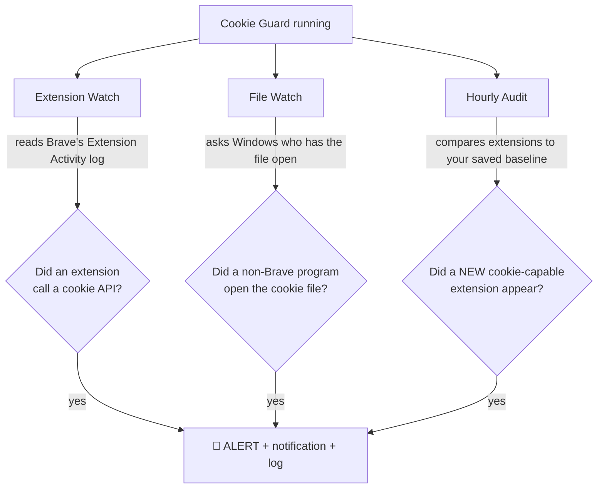

# 🍪 Cookie Guard

**A simple background tool that tells you — by name — whenever an extension or program reads your browser cookies.**


Cookie Guard watches your Brave (or Chrome) cookies and **raises an alert the moment something touches them** — naming the exact extension or program responsible. It's one small Python file. No installer, no account, no admin rights.

> ⚠️ **Cookie Guard is an alarm, not a lock.** It *tells you* when your cookies are read; it does not block the read. Treat an alert as "investigate now," not "you're protected."

---

## 📑 Table of Contents
- [Why this exists](#-why-this-exists)
- [What it does](#-what-it-does)
- [How it works](#-how-it-works)
- [Example alert](#-example-alert)
- [Requirements](#-requirements)
- [Installation](#-installation)
- [One-time setup (important)](#-one-time-setup-important)
- [How to use it](#-how-to-use-it)
- [Understanding the alerts](#-understanding-the-alerts)
- [Run it in the background](#-run-it-in-the-background)
- [Honest limitations](#-honest-limitations)
- [FAQ](#-faq)
- [Staying safe](#-staying-safe)
- [License](#-license)

---

## 🎯 Why this exists

Your **cookies** are what keep you logged in to websites. Some of them are **session tokens** — if someone copies one, they can log in *as you* without your password. This is called **cookie hijacking** or **session hijacking**.

Two things can steal cookies:

1. **A bad browser extension** — one you installed that quietly reads your cookies.
2. **Malware or shady software** — a program on your PC that reads the browser's cookie file off the disk.

The frustrating part: a normal person has **no way to see this happening**. Browsers hide one extension's activity from everything else, and malware copies files silently.

**Cookie Guard closes that blind spot.** It watches both paths and names the culprit.

---

## ✨ What it does

| # | Watcher | Catches | Tells you |
|---|---------|---------|-----------|
| 1 | **Extension watch** | An **extension** calling a cookie API | Which extension, which call, which cookie |
| 2 | **File watch** | An **external program** opening the cookie file | Which program, its path, which file |
| 3 | **Hourly audit** | A **new** cookie-capable extension being installed | The new extension's name and risk level |

Every alert is shown on screen, popped as a desktop notification, and saved to `cookie_guard.log`.

---

## ⚙️ How it works



In plain English:

- **Extension watch** reads a log that Brave/Chrome can keep of everything your extensions do. When an extension calls a cookie function (like `cookies.get`), Cookie Guard sees it and alerts you.
- **File watch** asks Windows directly, *"which programs currently have my cookie file open?"* If it's anything other than the real Brave, you get an alert. (This is the same mechanism Windows uses when it says "this file is in use by…")
- **Hourly audit** looks at all your extensions, notices which ones have permission to read cookies, and warns you if a **new** one shows up that you didn't have before.

---

## 🖥️ Example alert

When an extension reads a cookie, you'll see something like this:

```
!!!!!!!!!!!!!!!!!!!!!!!!!!!!!!!!!!!!!!!!!!!!!!!!!!!!!!!!!!!!!!!!!!!!!!
  EXTENSION READ A COOKIE
!!!!!!!!!!!!!!!!!!!!!!!!!!!!!!!!!!!!!!!!!!!!!!!!!!!!!!!!!!!!!!!!!!!!!!
  extension : Some Extension Name (abcdefgh...)
  api call  : cookies.get
  args      : [{"name":"auth-token-data"}]
  time      : 2026-07-04 18:59:46
!!!!!!!!!!!!!!!!!!!!!!!!!!!!!!!!!!!!!!!!!!!!!!!!!!!!!!!!!!!!!!!!!!!!!!
```

That tells you the extension's **name**, the **exact call** it made, and **which cookie** it read. If you see an extension reading a `auth-token` or `session` cookie and its job has nothing to do with logins — that's a red flag.

---

## 📦 Requirements

- **Windows 11** (Windows 10 also works)
- **Brave** or **Google Chrome**
- **Python 3.8 or newer** — get it from [python.org](https://www.python.org/downloads/) (during install, tick **"Add Python to PATH"**)
- One optional Python package for desktop pop-ups:

```bash
pip install plyer
```

> The tool still works without `plyer` — you'll just get on-screen and log alerts instead of pop-ups.

---

## 🚀 Installation

1. Download `cookie_guard.py` from this repository (green **Code** button → **Download ZIP**, or just save the file).
2. Put it in a folder you'll remember, for example `C:\Users\YourName\CookieGuard`.
3. Open **PowerShell** in that folder (Shift + right-click the folder → *Open PowerShell window here*).

That's it — there's nothing to install for the tool itself. It's one file.

---

## 🔧 One-time setup (important)

The **Extension watch** needs Brave/Chrome to keep an activity log, which is **turned off by default**. Turn it on once:

1. **Fully quit Brave** (also check the tray icon near the clock).
2. **Right-click** your Brave shortcut → **Properties**.
3. In the **Target** box, add a space and this at the very end:
   ```
   --enable-extension-activity-logging
   ```
   It should look like:
   ```
   "C:\...\Brave-Browser\Application\brave.exe" --enable-extension-activity-logging
   ```
4. Click **Apply** → **OK**.
5. **Always open Brave from this shortcut** from now on.

> 💡 You can check it's working in the browser: go to `brave://extensions`, turn on **Developer mode**, open any extension's **Details**, and click **View activity log**.

The **File watch** needs no setup — it works right away.

---

## ▶️ How to use it

**Start it (main mode):**
```bash
python cookie_guard.py --browser brave
```
Leave the window open. It quietly watches and alerts you when something reads your cookies.

**Save your "trusted" list once**, so the hourly check can spot new extensions later:
```bash
python cookie_guard.py --browser brave --save-baseline
```

**Other handy commands:**

| Command | What it does |
|---------|--------------|
| `--browser chrome` | Watch Chrome instead of Brave |
| `--audit` | Just list your cookie-capable extensions and exit |
| `--save-baseline` | Remember your current extensions as trusted |
| `--include-webrequest` | Also flag `webRequest` activity (noisier; good for testing) |
| `--no-notify` | No desktop pop-ups (screen + log only) |

**Stop it:** press `Ctrl + C`.

---

## 🔍 Understanding the alerts

| Alert | Meaning | What to do |
|-------|---------|------------|
| **EXTENSION READ A COOKIE** | An extension called a cookie API | If its job doesn't need cookies (e.g. an exporter reading a login token), remove it |
| **EXTERNAL PROGRAM OPENED YOUR COOKIE FILE** | A non-Brave program opened the cookie file | If you don't recognize the program, scan for malware and revoke your sessions |
| **NEW COOKIE-CAPABLE EXTENSION APPEARED** | A new extension with cookie access showed up | Make sure *you* installed it on purpose |

**If you get a real alert you can't explain:**
1. Remove the extension / close the program.
2. Log out of your important accounts **from a different device** (or change the password) — this makes any stolen cookie useless.
3. Run a malware scan.

---

## 🌙 Run it in the background

**Option A — hidden, no window:** double-click `run_hidden.vbs`. Nothing appears, but it's running. You still get pop-ups and the log. To stop it, double-click `stop_cookie_guard.bat`.

**Option B — start automatically at login:**
1. Press `Win + R`, type `shell:startup`, press Enter.
2. Copy a **shortcut** to `run_hidden.vbs` into that folder.

Now Cookie Guard protects you from every login onward.

> Background extension-watching only works if Brave was launched with the activity-logging flag from the setup step. Keep using your edited Brave shortcut.

---

## ⚖️ Honest limitations

Please read this so you trust the tool the right amount:

- **It's an alarm, not a lock.** It reports access *after* it happens. It does not block it. The real protection is removing bad extensions and revoking sessions.
- **It can't catch every trick.** A very advanced attacker could read cookies in ways that don't show up as a normal cookie API call or a normal file open. Cookie Guard catches the **common** methods, which is most of them — not all.
- **Extension watch needs the activity-log flag.** Without the one-time setup, only the file watch runs.
- **File watch is Windows-only** (it uses a Windows feature). The extension watch works on any OS where the browser writes the activity log.

**The best protection is still prevention:** only install extensions you trust, keep your browser updated, and ask *"why does this extension need cookie access?"* before installing.

---

## ❓ FAQ

**Does this change how my browser works?**
No. Brave looks and behaves exactly the same. The tool only *reads* logs and file info.

**Is it safe / does it steal anything?**
Cookie Guard is purely defensive. It never decrypts your cookie values and never sends anything anywhere. It only watches and alerts, locally, on your PC.

**Will it slow down my PC?**
No noticeable impact. It checks quietly every 1–2 seconds.

**I got "Extension activity log is OFF."**
You opened Brave from a shortcut without the flag. Redo the [one-time setup](#-one-time-setup-important) and launch Brave from the edited shortcut.

**Can I use it for Chrome?**
Yes — add `--browser chrome` and use a Chrome shortcut with the same flag.

---

## 🛡️ Staying safe

- Only install extensions from the official store, and only ones you actually need.
- Be suspicious of extensions asking for **cookie** or **all-sites** access when their job doesn't need it.
- Keep Brave/Chrome updated (modern versions make stolen cookie files harder to use).
- Log out of important accounts when you're done; short sessions = smaller risk.
- If in doubt after an alert: change your password from a trusted device — it ends existing sessions.

---

## 📄 License

MIT License — free to use, change, and share. See [LICENSE](LICENSE).

---

*Made for personal, defensive use on your own computer. Stay safe out there. 🍪🛡️*
